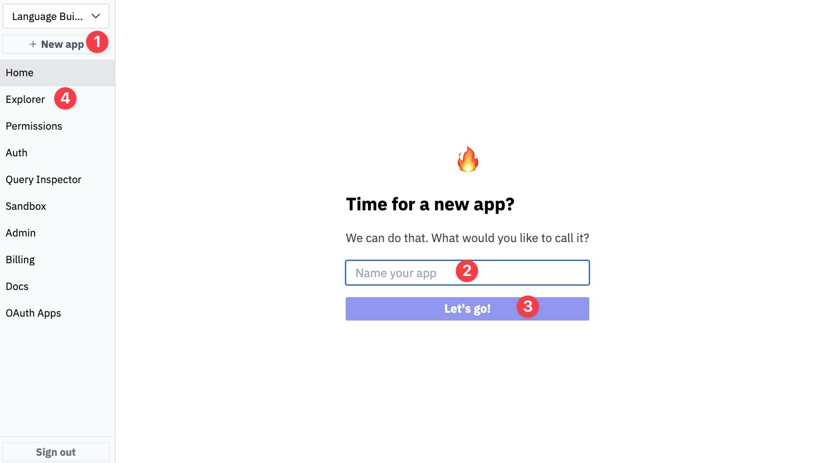
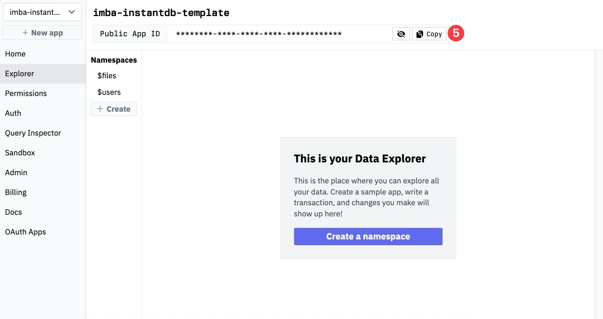
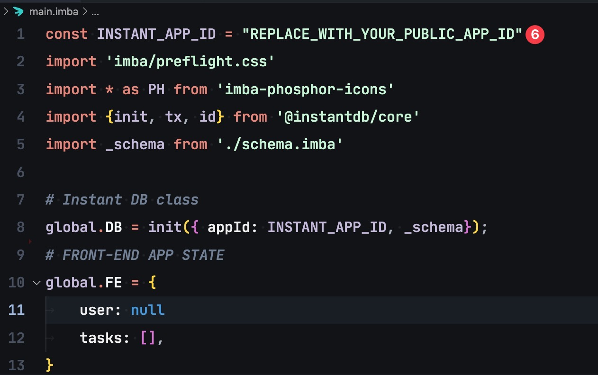

# Imba + InstantDB — The simplest web-stack.

Get your app up and running in 1 minute with Imba and InstantDB.


## Setup Imba Project
1. **Clone Repo**
```
git clone https://github.com/ericvida/imba-instantdb-template.git app-folder-name
```
2. **Open directory**
```
cd ./app-folder-name
```
3. **Install Dependencies**:
```
npm install
```
4.  **Run the App local server**:
```
npm run dev
```

## Setup InstantDB
**Prerequisite**: Sign up and login to [instantdb.com](https://instantdb.com).

1. Click on + New App button
2. Enter the name of your app
3. and click on "Let's go!"
4. Click on Home or Explorer to view your APP ID



5. Copy Public App ID



6. Paste the Public App ID on line 1 on index.imba and your app is ready to go.



## Use App

1. If you already followed (Setup Imba Project) steps, your localhost server should be running.
2. Open [https://localhost:3000](https://localhost:3000) in your browser.
3. Enter your email to receive a magic login code in your inbox
4. Enter the magic code in the app and click [Login] button.
5. you can create, read, edit, delete notes, and logout right out of the box.
6. Make great things!


