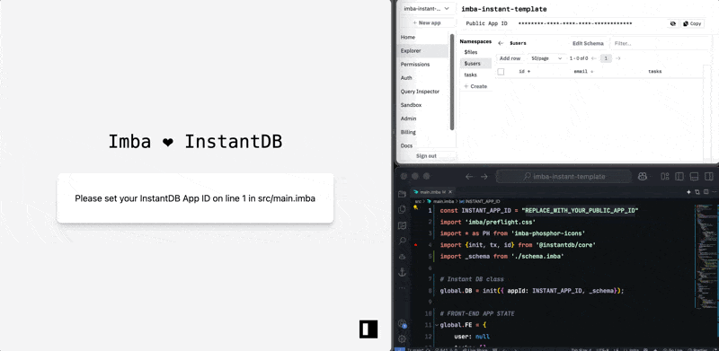

# Imba + InstantDB — The simplest web-stack.

Get your app up and running in 1 minute with Imba and InstantDB.


## Setup Imba Project
1. **Clone Repo**
```
git clone https://github.com/ericvida/imba-instantdb-template.git app-folder-name
```
2. **Open directory**
```
cd ./app-folder-name
```
3. **Install Dependencies**:
```
npm install
```
4.  **Run the App local server**:
```
npm run dev
```

## Setup InstantDB
**Prerequisite**: Sign up and login to [instantdb.com](https://instantdb.com).


1. Click on `+ new app`
2. Copy APP's ID and paste it as a value for INSTANT_APP_ID on line 1 of [src/main.imba]() file and save the file.

## Use App

1. With the local server running, open [https://localhost:3000](https://localhost:3000)
2. Enter your email to receive a magic login code in your inbox
3. Enter the magic code in the app and click [Login] button.
4. you can create, read, edit, delete notes, and logout right out of the box.
5. Make great things!

