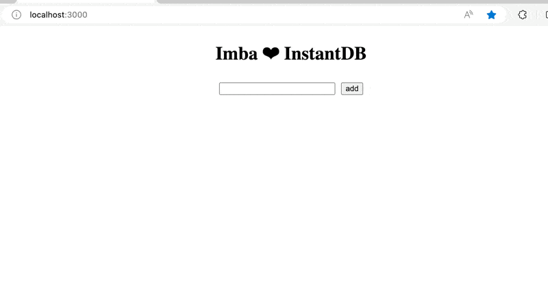

# Imba + InstantDB — The simplest web-stack.

Get your app up and running in 1 minute with Imba and InstantDB.


## Setup Imba Project
1. **Clone Repo**
```
git clone https://github.com/ericvida/imba-instantdb-template.git app-folder-name
```
2. **Open directory**
```
cd ./app-folder-name
```
3. **Install Dependencies**:
```
npm install
```
4.  **Run the App local server**:
```
npm run dev
```

## Setup InstantDB
**Prerequisite**: Sign up and login to [instantdb.com](https://instantdb.com).

1. Click on `+ new app`
2. Copy APP's ID and paste it into string on line 1 of [src/main.imba]() file.
3. Open the `Explorer` Tab on your App dashboard
4. Click on `+ create` and create a namespace called **notes** in lowercase.
5. Click on the new `notes` namespace.
6. Click on the `Edit Schema` button on the top right.
7. Click on `+ New attribute`
8. Type **content** in Name input field.
   - Leave constraints unchecked.
9. Click on `Create Attribute`
10. Click here to view your working app in your browser: [https://localhost:3000](https://localhost:3000)
